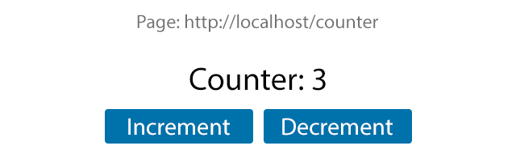
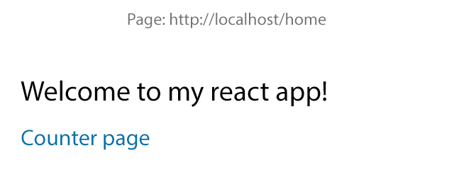

# React exercises

## Step 1

Read [React](https://reactjs.org/docs) and [react-router](https://reacttraining.com/react-router/web/guides/quick-start) docs.

Use `create-react-app` to create an empty application. Get familiar with the project structure and files.

---

Create a page in path `/home` with the following content:

---

## Step 2

Create a second page in path `/counter` that provides a simple counter that increments/decrements by one when respective buttons are pressed.

---

## Step 3

Add a `<Link>` component from home page that navigates to `/counter` when clicked.

